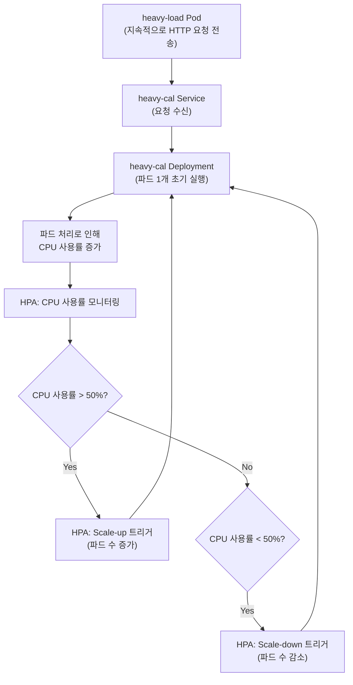

## 고급 스케줄링
- k8s에서 어떤 프로세스(컨테이너)를 어느 노드에 할당할지 어떤 프로세스끼리 묶어서 할당할지 프로세스 및 노드의 개수를 어떻게 조절할지 결정
- 기본적으로 k8s에서 Pod의 스케줄링을 책임지지만 사용자가 좀 더 상세하게 프로세스를 스케줄링 할 수 있음
  
## 고가용성 - Pod 레벨
- Pod의 리소스 사용량에 따라 자동으로 확장하는 HorizontalPodAutoScaler(HPA) 리소스를 제공함
- HPA는 Pod의 개수를 수평적으로 자동 확장함(Scale-Out) > 개수를 늘림 / 성능을 높이는건 수식적 확장(Sclae-Up)
- metrics server는 NKS에서는 클러스터 생성할때 같이 생성해줌


### 실습

무거운 계산을 수행할 웹서버 생성<br>
``` kubectl apply -f heavy-cal.yaml```
<details>
  <summary>heavy-cal.yaml</summary>

```yaml
# apiVersion: apps/v1  # Kubernetes에서 사용할 API 버전 (Deployment는 apps/v1 사용)
apiVersion: apps/v1  
kind: Deployment  # 리소스 종류를 Deployment로 설정
metadata:
  name: heavy-cal  # Deployment의 이름을 'heavy-cal'로 설정
spec:
  selector:  # 배포할 파드를 선택하는 레이블
    matchLabels:
      run: heavy-cal  # 선택할 파드의 레이블: run=heavy-cal
  replicas: 1  # 생성할 파드 수를 1로 설정 (처음에 한 개의 파드만 실행)
  template:  # 파드 템플릿 정의
    metadata:
      labels:
        run: heavy-cal  # 파드에 대한 레이블 설정: run=heavy-cal
    spec:  # 파드 사양 정의
      containers:  # 파드 내에 배치할 컨테이너 정의
      - name: heavy-cal  # 컨테이너 이름
        image: k8s.gcr.io/hpa-example  # 사용할 컨테이너 이미지
        ports:
        - containerPort: 80  # 컨테이너가 사용할 포트 80
        resources:  # 컨테이너의 리소스 요청 및 제한
          limits:
            cpu: 500m  # CPU 사용의 최대 제한 (500m는 0.5 CPU)
          requests:
            cpu: 300m  # 컨테이너가 요청할 CPU 사용량 (300m는 0.3 CPU)
---
# apiVersion: v1  # 서비스 객체의 API 버전
apiVersion: v1  
kind: Service  # 리소스 종류를 Service로 설정
metadata:
  name: heavy-cal  # 서비스의 이름을 'heavy-cal'로 설정
spec:
  ports:  # 서비스가 노출할 포트 정의
  - port: 80  # 서비스가 외부에 노출할 포트 번호
  selector:  # 이 서비스가 연결할 파드를 선택하는 레이블
    run: heavy-cal  # 선택할 파드의 레이블: run=heavy-cal
 ```
</details>

HorizontalPodAutoscaler 리소스 생성<br>
```kubectl apply -f hpa.yaml```

<details>
  <summary>hpa.yaml</summary>

```yaml
# hpa.yaml
apiVersion: autoscaling/v1  # HPA(HorizontalPodAutoscaler)의 API 버전 지정
kind: HorizontalPodAutoscaler  # 리소스 종류를 HPA로 설정
metadata:
  name: heavy-cal  # HPA의 이름을 'heavy-cal'로 지정
spec:
  maxReplicas: 50  # 최대 50개의 레플리카까지 확장 가능
  minReplicas: 1  # 최소 1개의 레플리카를 유지
  scaleTargetRef:  # 스케일링할 대상 설정
    apiVersion: apps/v1  # 대상의 API 버전 (Deployment의 경우 apps/v1)
    kind: Deployment  # 스케일링 대상의 종류 (Deployment)
    name: heavy-cal  # 스케일링할 Deployment의 이름 ('heavy-cal')
  targetCPUUtilizationPercentage: 50  # 평균 CPU 사용률이 50%를 초과하면 스케일링 수행, memory나 다른 리소스도 사용이 가능하다
```
</details> 


서비스에 부하를 주는 Pod 생성<br>
```kubectl apply -f heavy-load.yaml```

<details>
  <summary>heavy-load.yaml</summary>

```yaml
# apiVersion: v1  # Pod 객체의 API 버전
apiVersion: v1  
kind: Pod  # 리소스 종류를 Pod로 설정
metadata:
  name: heavy-load  # Pod의 이름을 'heavy-load'로 설정
spec:  # Pod의 사양 정의
  containers:  # Pod 내의 컨테이너 정의
  - name: busybox  # 컨테이너 이름을 'busybox'로 설정
    image: busybox  # 사용할 Docker 이미지로 'busybox' 설정
    command: ["/bin/sh"]  # 컨테이너에서 실행할 기본 명령어를 '/bin/sh'로 설정
    args: ["-c", "while true; do wget -q -O- http://heavy-cal; done"]  # 무한 루프에서 http://heavy-cal로 요청을 보내는 명령어 설정
```
</details> 




