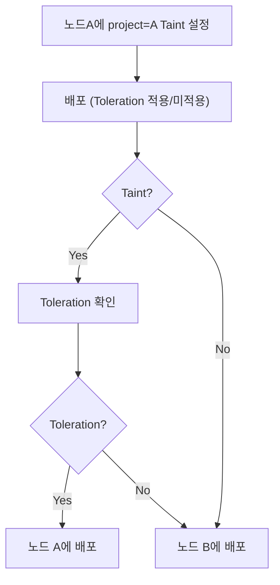

```mermaid
flowchart TD
  A["노드A에 project=A Taint 설정"]
  B["배포 (Toleration 적용/미적용)"]
  C{"Taint?"}
  D["Toleration 확인"]
  E["노드 B에 배포"]
  F{"Toleration?"}
  G["노드 A에 배포"]

  A --> B
  B --> C
  C -->|Yes| D
  C -->|No| E
  D --> F
  F -->|Yes| G
  F -->|No| E
```
