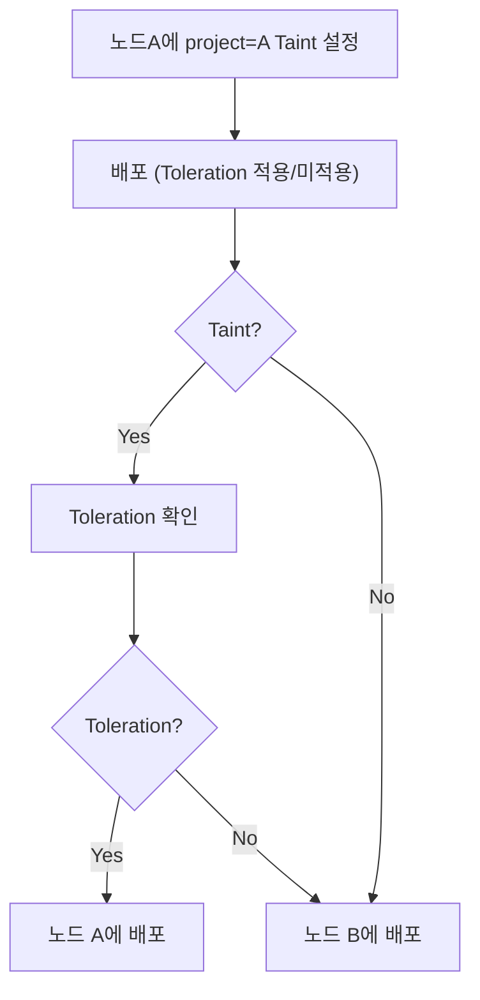

# Taint & Toleration

## Taint
- Taint는 오염시키다 오점을 남기다라는 뜻으로 Node 리소스에 적용하는 설정값
- 노드에 Taint를 남기게 되면 Pod들이 노드가 오염되었기 때문에 쉽게 다가가지(스케줄링) 못함

## Toleration
- 견디다, 용인하다라는 뜻으로 Taint가 설정된 노드라 해도 Pod가 참을 수 있으면(Tolerate) Taint된 노드에 스케줄링 될 수 있음

